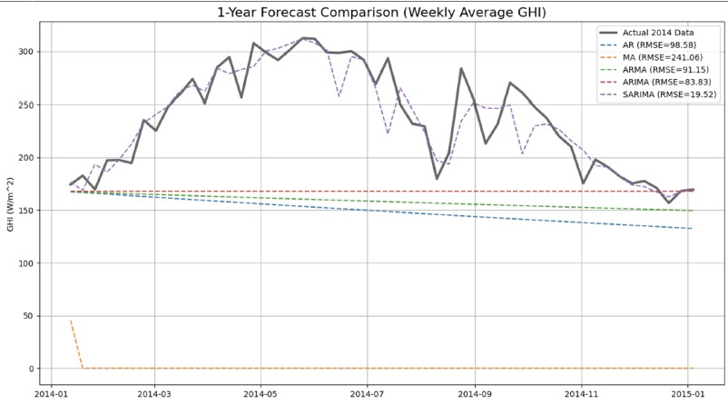
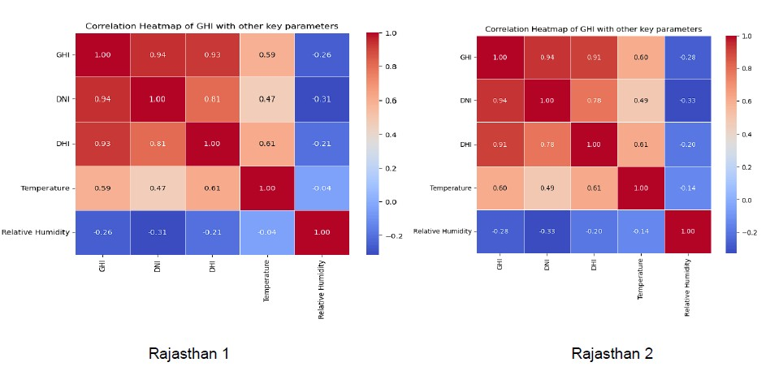

# Statistical Analysis and Forecasting of Solar Energy in Rajasthan, India

## Overview
This repository contains the code and analysis for a time-series forecasting project aimed at predicting **Global Horizontal Irradiance (GHI)** for two solar parks in Rajasthan, India using 15 years of hourly data (2000–2014). This project compares statistical time-series forecasting models like AR, MA, ARMA and ARIMA against a seasonal model, SARIMA.

The analysis demonstrates that **SARIMA** outperforms baseline models (for both solar parks in Rajasthan) by capturing the strong annual seasonality of GHI thereby achieving a forecast RMSE of **19.52 W/m²** compared to 83.83 W/m² for standard ARIMA.

  
   
  <em>Figure 1: The SARIMA model (dashed purple) closely tracks the actual 2014 data (solid grey), capturing the seasonal peaks that other models missed</em>

## My Contributions
While this was a group project for MATH F432: **Applied Statistical Methods**, I was responsible for the technical implementation and statistical analysis pipeline found in the `notebooks/` folder.

My specific contributions included:
* **Data Loading and Preprocessing:** Wrote the Python script to load and clean the the 15-year raw dataset by handling missing values so it is ready to be input to the time-series forecasting models.
*  **Descriptive Statistics:** Plotted hourly and daily plots (in a week and a year) of GHI data to critically understand the nature of the given data. Along with the computation of several key statistics, plotted a heatmap that showed the correlation of GHI with other key variables in the dataset.

  
   
  <em>Figure 2: GHI is heavily correlated to DNI and DHI</em>

START FROM HERE
* **Statistical Verification:** Implemented the **Shapiro-Wilk test** to statistically prove the non-normality of GHI data ($p < 0.05$) and performed **ADF tests** to check for stationarity[cite: 1195].
* [cite_start]**Model Development:** Coded the implementation of the **SARIMA(1,1,1)×(1,1,0,52)** model using `statsmodels`, including the grid search for optimal parameters[cite: 1537].
* [cite_start]**Forecasting Strategy:** Designed the **sliding window approach** (training on the trailing 60 days) to generate the granular 7-day operational forecast[cite: 1602].

## Repository Structure
* **`notebooks/`**:
    * `Raj1.ipynb`: My complete analysis pipeline for Solar Park 1 (EDA, Decomposition, Modeling).
    * `Raj2.ipynb`: Validation pipeline I built for Solar Park 2 to ensure model generalization.
* **`docs/`**: Contains the full **Project Report** detailing mathematical formulations and group findings.

## Methodology
The project follows a rigorous statistical workflow implemented in Python:

### 1. Exploratory Data Analysis (EDA)
* **Normality Testing:** Visually (Histogram/Q-Q Plot) and statistically (Shapiro-Wilk Test) confirmed that GHI data is **non-normal** ($p < 0.05$).
* **Correlation Analysis:** Identified strong correlation ($r=0.94$) between GHI and DNI, and negative correlation with humidity.
* **Seasonality:** Detected clear annual cycles peaking in summer (April–June) and dipping during the monsoon.

### 2. Time Series Decomposition
Decomposed the 15-year daily average GHI into **Trend**, **Seasonality**, and **Residuals** using an additive model to isolate the annual signal.

  
   
  <em>Figure 2: Decomposition of 15-year GHI data showing clear annual seasonality.</em>

### 3. Predictive Modeling
We evaluated five model architectures based on Root Mean Square Error (RMSE):
* **Baseline:** Autoregressive (AR), Moving Average (MA), ARMA.
* **Trend-Aware:** ARIMA (Autoregressive Integrated Moving Average).
* **Seasonal-Aware:** SARIMA (Seasonal ARIMA) with parameters `(1,1,1)×(1,1,0,52)`.

## Results & Performance
The **SARIMA model** proved to be the superior forecaster. Standard models (AR/ARIMA) failed to capture the recurring annual "bell curve" of solar radiation, resulting in flat-line predictions for long horizons.

| Model | Order `(p,d,q)×(P,D,Q,s)` | RMSE ($W/m^2$) | Outcome |
| :--- | :--- | :--- | :--- |
| **SARIMA** | **`(1,1,1)×(1,1,0,52)`** | **16.47** | **Best Performance** |
| ARIMA | `(1,1,1)×(0,0,0,0)` | 81.44 | Failed to capture seasonality |
| ARMA | `(1,0,1)×(0,0,0,0)` | 87.41 | Flatline Forecast |
| AR | `(1,0,0)×(0,0,0,0)` | 90.63 | High Error |
| MA | `(0,0,1)×(0,0,0,0)` | 242.27 | Poor Fit |

## Key Findings
* **Weekly vs. Daily:** Forecasting weekly averages yielded higher accuracy by smoothing out high-frequency noise caused by daily cloud cover variations.
* [cite_start]**Operational Value:** The sliding-window SARIMA approach successfully generated a granular 168-hour (7-day) forecast suitable for real-world grid dispatch planning[cite: 1602].

## Usage
1. Clone the repository.
2. Install dependencies: `pip install pandas numpy statsmodels matplotlib seaborn`.
3. Run `notebooks/Raj1.ipynb` to reproduce the primary analysis.

## Citation
**Friedman Group**. "Statistical Analysis and Forecasting of Solar Energy." BITS Pilani, 2025.
