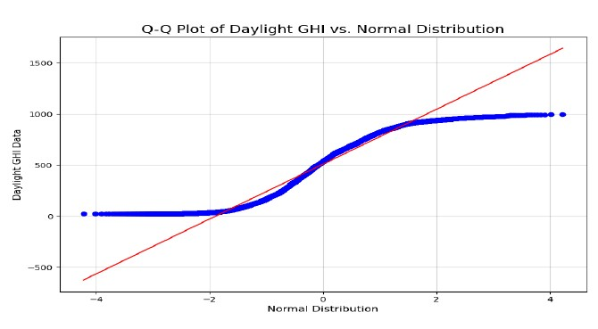
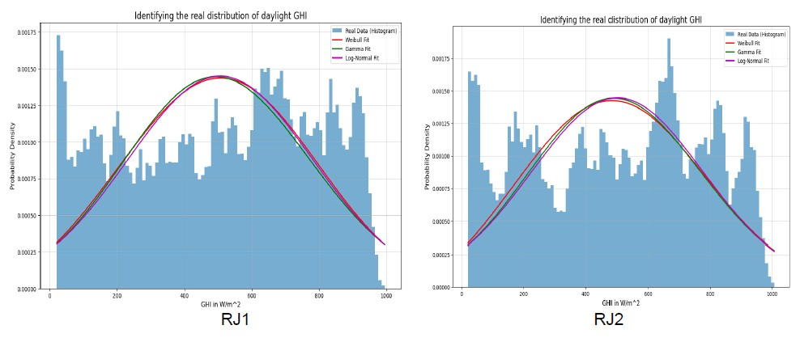
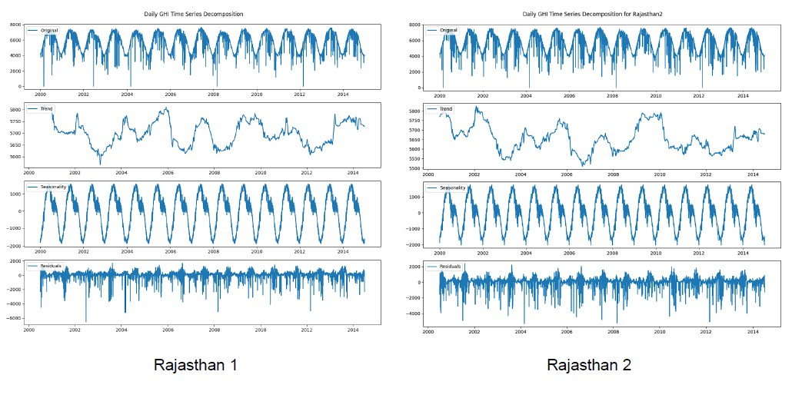
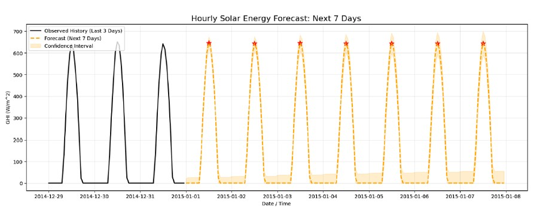

# Statistical Analysis and Forecasting of Solar Energy in Rajasthan, India


## Overview
This repository contains the code and analysis for a time-series forecasting project aimed at predicting **Global Horizontal Irradiance (GHI)** for two solar parks in Rajasthan, India using 15 years of hourly data (2000–2014). This project compares statistical time-series forecasting models like AR, MA, ARMA and ARIMA against a seasonal model, SARIMA.

The analysis demonstrates that **SARIMA** outperforms baseline models (for both solar parks in Rajasthan) by capturing the strong annual seasonality of GHI thereby achieving a forecast RMSE of **19.52 W/m²** compared to 83.83 W/m² for standard ARIMA.

<p align="center">
  
  <br>
  <em>Figure 1: The SARIMA model (dashed purple) closely tracks the actual 2014 data (solid grey), capturing the seasonal peaks that other models missed</em>
</p>

## My Contributions
While this was a group project for MATH F432: **Applied Statistical Methods**, I was responsible for the technical implementation and statistical analysis pipeline found in the `notebooks/` folder.

My specific contributions included:
* **Data Loading and Preprocessing:** Wrote the Python script to load and clean the the 15-year raw dataset by handling missing values so it is ready to be input to the time-series forecasting models.
*  **Descriptive Statistics:** Plotted hourly and daily plots (in a week and a year) of GHI data to critically understand the nature of the given data. Along with the computation of several key statistics, plotted a heatmap that showed the correlation of GHI with other key variables in the dataset.
<p align="center">
  
  <br>
  <em>Figure 2: GHI is heavily correlated to DNI and DHI</em>
</p>

* **Statistical Verification:** Implemented the **Shapiro-Wilk test** to statistically prove the statistically prove the non-normality of daylight GHI ($p < 0.05$) and also plotted the Q-Q plot to verify the same.
<p align="center">
  
  <br>
  <em>Figure 3: Daylight GHI does not follow a normal distribution </em>
</p>  

* **Daylight GHI Distribution Identification:** Tried to graphically identify the probability distribution of daylight GHI by overlaying known probability distributions like Gamma, Log-Normal and Weibull over the histogram of daylight GHI. As it did not match with any of these distributions, I came to the conclusion that the daylight GHI can be a mixture of these distributions. None of them are able to capture the complex nature of daylight GHI.
<p align="center">
  
  <br>
  <em>Figure 4: Daylight GHI does not conform to any of the standard probability distributions </em>
</p> 

##  Project Methodology
### 1. Exploratory Data Analysis (EDA)
* **Normality Testing:** Visually (Histogram/Q-Q Plot) and statistically (Shapiro-Wilk Test) confirmed that GHI data is **non-normal** ($p < 0.05$).
* **Correlation Analysis:** Identified strong correlation ($r=0.94$) between GHI and DNI, and negative correlation with humidity.
* **Seasonality:** Detected clear annual cycles peaking in summer (April–June) and dipping during the monsoon.

### 2. Time Series Decomposition
Decomposed the 15-year daily average GHI into **Trend**, **Seasonality**, and **Residuals** using an additive model to isolate the annual signal.

<p align="center">
  
  <br>
  <em>Figure 5: Decomposition of 15-year GHI data showing clear annual seasonality.</em>
</p>

### 3. Predictive Modeling
We evaluated five model architectures based on Root Mean Square Error (RMSE):
* **Baseline:** Autoregressive (AR), Moving Average (MA), ARMA.
* **Trend-Aware:** ARIMA (Autoregressive Integrated Moving Average).
* **Seasonal-Aware:** SARIMA (Seasonal ARIMA) with parameters `(1,1,1)×(1,1,0,52)`.

Visual results are shown in Figure 1.

### 4. Daily Operational Forecasting
For short-term forecasting, we use a sliding window **SARIMA** approach. The model is retrained daily on the most recent 60 days (1,440 hours) of data to prioritize recent weather patterns. This enables a granular 168-hour (7-day) hourly forecast while filtering out outdated historical noise.

<p align="center">
  
  <br>
  <em>Figure 6: Week long hourly GHI forecast</em>
</p>

## Results & Performance
The **SARIMA model** proved to be the superior forecaster. Standard models (AR/ARIMA) failed to capture the  annual seasonality of solar radiation (GHI), thereby resulting in flat-line predictions for long horizons.

| Model | Order `(p,d,q)×(P,D,Q,s)` | RMSE ($W/m^2$) | Outcome |
| :--- | :--- | :--- | :--- |
| **SARIMA** | **`(1,1,1)×(1,1,0,52)`** | **19.52** | **Best Performance** |
| ARIMA | `(1,1,1)×(0,0,0,0)` | 83.83 | Failed to capture seasonality |
| ARMA | `(1,0,1)×(0,0,0,0)` | 87.41 | Flatline Forecast |
| AR | `(1,0,0)×(0,0,0,0)` | 90.63 | High Error |
| MA | `(0,0,1)×(0,0,0,0)` | 242.27 | Poor Fit |

## Repository Structure
```text
solar-energy-forecasting-rajasthan/
│
├── notebooks/                  # Jupyter notebooks with my contributed code
│   ├── Raj1.ipynb              # Primary pipeline: EDA, Descriptive Statistics, Visualizations, Normality verification
│   └── Raj2.ipynb              # Validation pipeline: To see if similar results are seen in the other solar park
│
├── docs/                       # Project documentation
│   └── ProjectReport.pdf       # Full technical report and group findings
|   └── ProjectPresent.pdf      # Slides that were used in the final group presentation
|   └── ProblemStatement.pdf    # Original problem statement given by MATH F432 course instructor
│
├── assets/                     # Images for README visualization
│   ├── daily_forecast.jpg
│   ├── dist_type.jpg
│   └── forecast.jpg
│   └── heatmap.jpg
│   └── hist_raj1.jpg
│   └── qq_plot_raj1.jpg
│   └── ts_decomp.jpg


